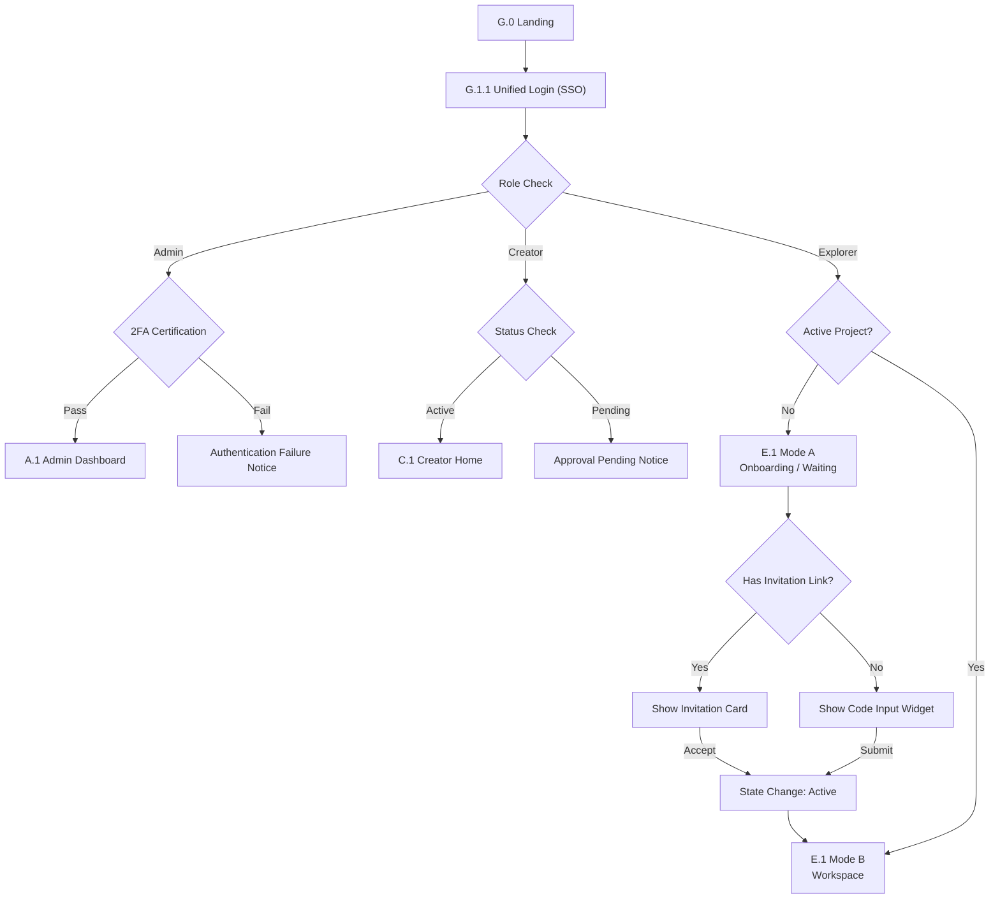
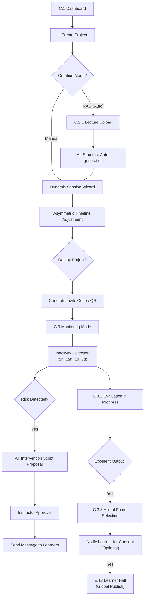
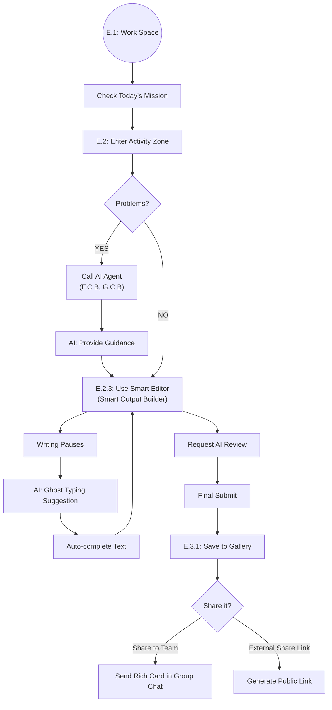

# User Flow

## Global Entry Flow

```mermaid
flowchart TD
    %% Entry
    G0[G.0 Landing]
    G11["G.1.1 Unified Login (SSO)"]
    RC{"Role Check"}

    G0 --> G11 --> RC

    %% Admin Path
    RC -->|Admin| A2FA{"2FA Certification"}
    A2FA -->|Pass| A1["A.1 Admin Dashboard"]
    A2FA -->|Fail| AFail["Authentication Failure Notice"]

    %% Creator Path
    RC -->|Creator| CStatus{"Status Check"}
    CStatus -->|Active| C1["C.1 Creator Home"]
    CStatus -->|Pending| CPending["Approval Pending Notice"]

    %% Explorer Path
    RC -->|Explorer| EActive{"Active Project?"}

    %% Explorer – No Active Project
    EActive -->|No| EModeA["E.1 Mode A<br>Onboarding / Waiting"]
    EModeA --> HasLink{"Has Invitation Link?"}

    HasLink -->|Yes| InviteCard["Show Invitation Card"]
    HasLink -->|No| CodeInput["Show Code Input Widget"]

    InviteCard -->|Accept| EActivate["State Change: Active"]
    CodeInput -->|Submit| EActivate

    EActivate --> EModeB["E.1 Mode B<br>Workspace"]

    %% Explorer – Has Active Project
    EActive -->|Yes| EModeB

```

## Creator Flow

```mermaid
flowchart TD
    %% Entry
    C1["C.1 Dashboard"]
    NewProj["+ Create Project"]
    Mode{"Creation Mode?"}

    C1 --> NewProj --> Mode

    %% Creation paths
    Mode -->|"Manual"| Wizard["Dynamic Session Wizard"]
    Mode -->|"RAG (Auto)"| Upload["C.2.1 Lecture Upload"]
    Upload --> AIgen["AI: Structure Auto-generation"]
    AIgen --> Wizard

    %% Build & Deploy
    Wizard --> Timeline["Asymmetric Timeline Adjustment"]
    Timeline --> DeployQ{"Deploy Project?"}

    DeployQ --> Invite["Generate Invite Code / QR"]
    Invite --> C3["C.3 Monitoring Mode"]

    %% Monitoring
    C3 --> IdleDetect["Inactivity Detection<br>(1h, 12h, 1d, 3d)"]
    IdleDetect --> Risk{"Risk Detected?"}

    %% Risk path
    Risk -->|Yes| AIintervene["AI: Intervention Script Proposal"]
    AIintervene --> Approve["Instructor Approval"]
    Approve --> Notify["Send Message to Learners"]

    %% Normal / Evaluation path
    IdleDetect --> Eval["C.3.2 Evaluation in Progress"]
    Eval --> Excellent{"Excellent Output?"}

    Excellent -->|Yes| Fame["C.3.3 Hall of Fame Selection"]
    Fame --> Consent["Notify Learner for Consent<br>(Optional)"]
    Consent -->|Yes| Publish["E.18 Learner Hall<br>(Global Publish)"]

```

## Explorer Flow

```mermaid
flowchart TD
    %% Entry
    E1((E.1: Work Space))
    Today[Check Today's Mission]
    E2[E.2: Enter Activity Zone]
    Prob{Problems?}

    E1 --> Today --> E2 --> Prob

    %% If problems: call AI agents -> guidance -> back to editor
    Prob -->|"YES"| Agent["Call AI Agent<br>(F.C.B, G.C.B)"]
    Agent --> Guide["AI: Provide Guidance"]
    Guide --> Editor

    %% If no problems: go straight to editor
    Prob -->|"NO"| Editor["E.2.3: Use Smart Editor<br>(Smart Output Builder)"]

    %% Ghost typing assist when writing stops
    Editor --> Pause["Writing Pauses"]
    Pause --> Ghost["AI: Ghost Typing Suggestion"]
    Ghost --> Auto["Auto-complete Text"]
    Auto --> Editor

    %% Review -> submit -> gallery save
    Editor --> Review["Request AI Review"]
    Review --> Submit["Final Submit"]
    Submit --> Gallery[E.3.1: Save to Gallery]

    %% Share decision
    Gallery --> Share{Share it?}
    Share -->|Share to Team| Rich[Send Rich Card in Group Chat]
    Share -->|External Share Link| Public[Generate Public Link]
```
